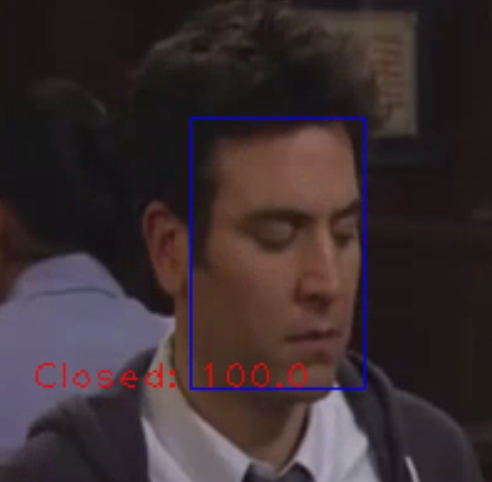

# OpenedClosedEyesDetector

* Criado por: Luiz Felipe Maciel Correia
* E-mail: y9luiz@hotmail.com


* Criado por: Luiz Felipe Maciel Correia
* E-mail: y9luiz@hotmail.com


### Demonstrações:

#### Video: 

https://www.youtube.com/watch?v=mTuczb6syts

Olhos fechados            |  Olhos abertos
:-------------------------:|:-------------------------:
  |  

Abra um terminal e siga os passos abaixo


### Dependências:

    sudo apt-get install python3
    sudo apt-get install python3-pip
    sudo apt install bzip2
    sudo apt install unrar
    pip3 install gdown

### Como instalar?

*   <b>Primeiro passo</b>:

Configure o script env.sh como source para definir algumas variáveis de ambiente e preparar algumas depêndencias e baixar alguns arquivos como nosso dataset, dependendo da sua internet isso pode levar algum tempo.

    source env.sh

*   <b>Segundo passo:</b>

Instale as depêndencias seguindo o comando a baixo:

    pip3 install -r requirements.txt

Agora siga os passos de como rodar o sistema

### Como rodar

*   Siga os seguintes passos no seu terminal:
*   <b>Utilizando uma webcam</b>

    ```
    source env.sh
    python3 detect_eyes_from_cam.py
    ```

### Resultados


|      |  Precision  |    Recall    |    F1 Score       |   support       |
| :---         |     :---:      |          ---: |      ---:  |     ---:  |
| ClosedFace   | 0.97     |  0.96   | 0.96      |     238      |
| OpenedFace     | 0.96       | 0.97    |      0.97    |     247      |
| -     | -       | -    |      -    |     -     |
| Accuracy     |   -     | -    |      0.96    |     485      |
| macro avg     | 0.97       | 0.96    |      0.96    |     485      |
| weighted avg     | 0.97       | 0.96    |      0.96    |     485      |

# Third-party related projects


[Ultra Light Fast Generic Face Detector](https://github.com/Linzaer/Ultra-Light-Fast-Generic-Face-Detector-1MB)
