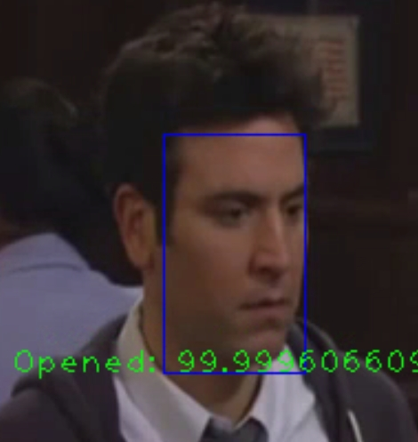

# OpenedClosedEyesDetecto

### Demonstrações:

#### Video: 

https://www.youtube.com/watch?v=mTuczb6syts

Olhos fechados            |  Olhos abertos
:-------------------------:|:-------------------------:
  |  

Abra um terminal e siga os passos abaixo

### Dependências:

    sudo apt-get install python3
    sudo apt-get install python3-pip
    sudo apt install bzip2
    sudo apt install unrar
    pip3 install gdown

### Como instalar?

Primeiro passo:

Configure o script env.sh como source para definir algumas variáveis de ambiente e preparar algumas depêndencias e baixar alguns arquivos como nosso dataset.

    source env.sh

Segundo passo:

Instale as depêndencias seguindo o comando a baixo:

    pip3 install -r requirements.txt

### Como rodar

Siga os seguintes passos:

    source env.sh

Utilizando uma webcam:

    python3 detect_eyes_from_cam.py
