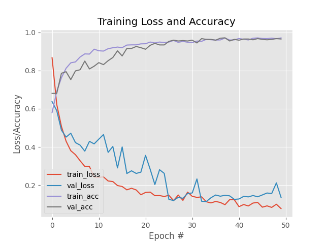

[Português](https://github.com/y9luiz/OpenedClosedEyesDetector/blob/main/README.md) | [English](https://github.com/y9luiz/OpenedClosedEyesDetector/blob/main/README_ENG.md) 

# OpenedClosedEyesDetecto

* Created by: Luiz Felipe Maciel Correia
* E-mail: y9luiz@hotmail.com


### Demonstration:

#### Video: 

https://www.youtube.com/watch?v=mTuczb6syts

Closed eyes            |  Opened eyes
:-------------------------:|:-------------------------:
  |  

Open your terminal and follow those steps below:


### Dependencies:

    sudo apt-get install python3
    sudo apt-get install python3-pip
    sudo apt install bzip2
    sudo apt install unrar
    pip3 install gdown

### How install?

*   <b>First step</b>:

Configure the script env.sh to be your source it will define some environment variables and to prepare some dependencies and download some files like your dataset, maybe it will take a while, depending on your internet connection

    source env.sh

*   <b>Second step:</b>

Install the python dependencies following this command:

    pip3 install -r requirements.txt

Now to run the code, follow these instructions

### How to run

*   On your terminal and <b>using a web cam</b> type:


    ```
    source env.sh
    python3 detect_eyes_from_cam.py
    ```

### Results



|      |  Precision  |    Recall    |    F1 Score       |   support       |
| :---         |     :---:      |          ---: |      ---:  |     ---:  |
| ClosedFace   | 0.97     |  0.96   | 0.96      |     238      |
| OpenedFace     | 0.96       | 0.97    |      0.97    |     247      |
| -     | -       | -    |      -    |     -     |
| Accuracy     |   -     | -    |      0.96    |     485      |
| macro avg     | 0.97       | 0.96    |      0.96    |     485      |
| weighted avg     | 0.97       | 0.96    |      0.96    |     485      |

# Third-party related projects


[Ultra Light Fast Generic Face Detector](https://github.com/Linzaer/Ultra-Light-Fast-Generic-Face-Detector-1MB)
